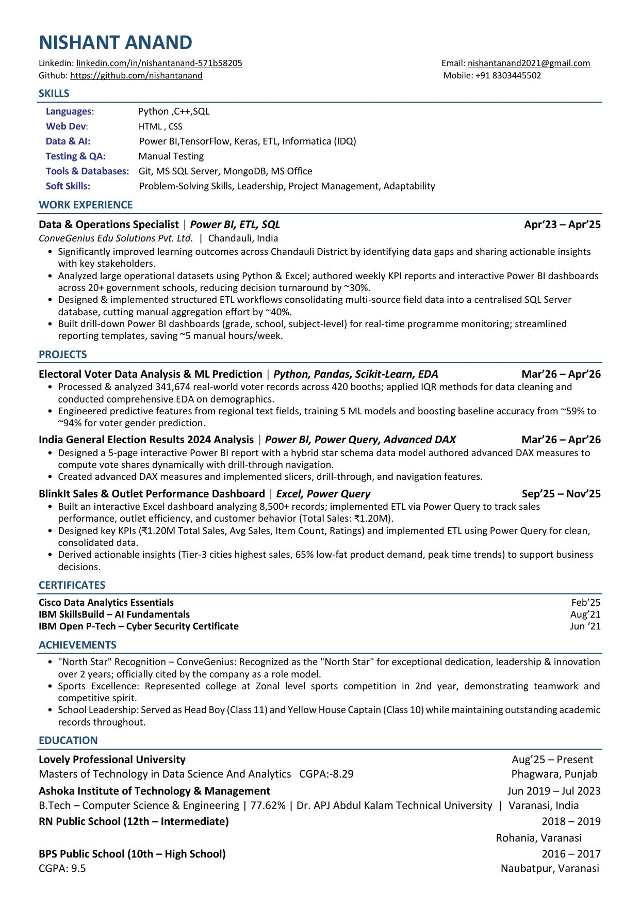

# DATA ANALYTICS — Interview Preparation

### 60 Technical Questions & Answers

**Candidate:** Nishant Anand  
**Role Applied For:** Data Analyst / Data Analytics  
**Target Package:** 12+ LPA

---

## Resume Snapshot

---

## Table of Contents

- [SQL](#sql)
- [Power BI & DAX](#power-bi-dax)
- [Excel & Power Query](#excel-power-query)
- [Python & Pandas](#python-pandas)
- [ETL & Informatica IDQ](#etl-informatica-idq)
- [Statistics & Machine Learning](#statistics-machine-learning)

---

## SQL

### Q1. What is the difference between WHERE and HAVING clauses?

*Tool/Topic: SQL*

**Ans:** WHERE filters individual rows before grouping/aggregation, while HAVING filters groups after GROUP BY is applied. WHERE cannot use aggregate functions, but HAVING can.

### Q2. What is the difference between INNER JOIN and LEFT JOIN?

*Tool/Topic: SQL*

**Ans:** INNER JOIN returns only matching rows from both tables, whereas LEFT JOIN returns all rows from the left table plus matched rows from the right table (NULL if no match).

### Q3. What are Primary Key and Foreign Key?

*Tool/Topic: SQL*

**Ans:** A Primary Key uniquely identifies each record in a table and cannot be NULL. A Foreign Key is a column referencing the Primary Key of another table, enforcing referential integrity.

### Q4. What is the difference between DELETE, TRUNCATE, and DROP?

*Tool/Topic: SQL*

**Ans:** DELETE removes rows with optional conditions and can be rolled back; TRUNCATE removes all rows instantly and resets identity, with minimal logging; DROP removes the entire table structure permanently.

### Q5. What are Window Functions? Give an example.

*Tool/Topic: SQL*

**Ans:** Window functions perform calculations across a set of rows related to the current row without collapsing them, e.g. ROW_NUMBER(), RANK(), and SUM() OVER(PARTITION BY ...) used for running totals or rankings.

### Q6. What is a Common Table Expression (CTE)?

*Tool/Topic: SQL*

**Ans:** A CTE, defined using WITH, is a temporary named result set that improves query readability and can be referenced within a SELECT, INSERT, UPDATE, or DELETE statement.

### Q7. What is the difference between UNION and UNION ALL?

*Tool/Topic: SQL*

**Ans:** UNION combines results of two queries and removes duplicate rows, while UNION ALL combines results without removing duplicates, making it faster.

### Q8. What is normalization and why is it used?

*Tool/Topic: SQL*

**Ans:** Normalization organizes data to reduce redundancy and improve integrity by dividing large tables into smaller related tables using keys, typically up to 3NF in analytics work.

### Q9. How do you find duplicate records in a table using SQL?

*Tool/Topic: SQL*

**Ans:** Use GROUP BY on the relevant columns with HAVING COUNT(*) > 1, or use ROW_NUMBER() OVER(PARTITION BY column) and filter rows where the row number is greater than 1.

### Q10. What is the difference between clustered and non-clustered index?

*Tool/Topic: SQL*

**Ans:** A clustered index physically sorts and stores table rows in order of the indexed column (one per table), while a non-clustered index creates a separate structure with pointers to the actual rows (multiple allowed).

### Q11. What is a subquery and where can it be used?

*Tool/Topic: SQL*

**Ans:** A subquery is a query nested inside another SQL statement; it can be used in SELECT, WHERE, FROM, or HAVING clauses to filter or compute intermediate results.

### Q12. How would you calculate a running total in SQL Server?

*Tool/Topic: SQL*

**Ans:** Use SUM(amount) OVER (ORDER BY date) or SUM(amount) OVER (PARTITION BY category ORDER BY date) to compute a cumulative total row by row.

---

## Power BI & DAX

### Q13. What is the difference between Power Query and DAX in Power BI?

*Tool/Topic: Power BI & DAX*

**Ans:** Power Query is used for ETL — importing, cleaning, and shaping data before it loads into the model, while DAX (Data Analysis Expressions) is used to create calculated columns and measures for analysis after loading.

### Q14. What is the difference between a Calculated Column and a Measure in DAX?

*Tool/Topic: Power BI & DAX*

**Ans:** A calculated column is computed row-by-row and stored in the table, increasing model size, whereas a measure is computed dynamically at query time based on the current filter context, making it more memory efficient.

### Q15. What is a Star Schema and why is it preferred in Power BI?

*Tool/Topic: Power BI & DAX*

**Ans:** A star schema has a central fact table connected to surrounding dimension tables, simplifying relationships and improving DAX performance compared to a flat or snowflake structure.

### Q16. Explain CALCULATE() function in DAX.

*Tool/Topic: Power BI & DAX*

**Ans:** CALCULATE() evaluates an expression in a modified filter context, allowing you to override or add filters, e.g. CALCULATE(SUM(Sales), Region="North") to compute sales only for the North region.

### Q17. What is the difference between Filter Context and Row Context in DAX?

*Tool/Topic: Power BI & DAX*

**Ans:** Row context evaluates an expression row by row, typically in calculated columns or iterator functions, while filter context is the set of filters (from slicers, rows, columns) applied when a measure is evaluated.

### Q18. What is a drill-through in Power BI?

*Tool/Topic: Power BI & DAX*

**Ans:** Drill-through lets users right-click a data point on one report page to navigate to a detailed page filtered to that specific context, useful for exploring granular data like a single school or outlet.

### Q19. What is the difference between Power BI Import mode and DirectQuery mode?

*Tool/Topic: Power BI & DAX*

**Ans:** Import mode loads and compresses data into Power BI's in-memory model for fast performance, while DirectQuery sends live queries to the source each time, giving real-time data at the cost of speed.

### Q20. What are slicers used for in Power BI dashboards?

*Tool/Topic: Power BI & DAX*

**Ans:** Slicers are visual filter controls that let end users interactively filter report data by fields such as region, date, or category without editing the underlying report.

### Q21. How do you optimize a slow Power BI report?

*Tool/Topic: Power BI & DAX*

**Ans:** Reduce cardinality of columns, use star schema instead of flat tables, avoid excessive calculated columns, disable auto date/time, and use variables in DAX measures to avoid repeated evaluation.

### Q22. What is the ALL() function used for in DAX?

*Tool/Topic: Power BI & DAX*

**Ans:** ALL() removes filters from a specified table or column, which is useful for calculating totals unaffected by slicers, such as percentage of grand total.

### Q23. What is Power Query M language used for?

*Tool/Topic: Power BI & DAX*

**Ans:** M is the functional language behind Power Query used to define data transformation steps such as merging, appending, pivoting, and cleaning data during the ETL process.

### Q24. How do you create a dynamic year-over-year (YoY) growth measure in DAX?

*Tool/Topic: Power BI & DAX*

**Ans:** Use a measure like YoY = DIVIDE(SUM(Sales[Amount]) - CALCULATE(SUM(Sales[Amount]), SAMEPERIODLASTYEAR(Dates[Date])), CALCULATE(SUM(Sales[Amount]), SAMEPERIODLASTYEAR(Dates[Date]))) to compare current and prior year performance.

---

## Excel & Power Query

### Q25. What is the difference between VLOOKUP and INDEX-MATCH?

*Tool/Topic: Excel & Power Query*

**Ans:** VLOOKUP searches a value in the leftmost column and returns data from a column to the right, but only searches left-to-right, while INDEX-MATCH is more flexible, faster on large data, and can look in any direction.

### Q26. What are Pivot Tables used for in Excel?

*Tool/Topic: Excel & Power Query*

**Ans:** Pivot Tables summarize and aggregate large datasets quickly, allowing grouping, filtering, and cross-tabulation of data such as sales by outlet and month without writing formulas.

### Q27. What is Power Query in Excel used for?

*Tool/Topic: Excel & Power Query*

**Ans:** Power Query is Excel's ETL tool used to import, clean, merge, and transform data from multiple sources before loading it into a worksheet or the data model.

### Q28. How do you remove duplicate records in Excel?

*Tool/Topic: Excel & Power Query*

**Ans:** Select the data range and use Data > Remove Duplicates, or use a formula like COUNTIF to flag duplicates before filtering them out.

### Q29. What is the difference between COUNTIF and SUMIF?

*Tool/Topic: Excel & Power Query*

**Ans:** COUNTIF counts the number of cells meeting a condition, while SUMIF sums the values of cells meeting a condition, both operating on a single criteria range.

### Q30. What are conditional formatting and its use in dashboards?

*Tool/Topic: Excel & Power Query*

**Ans:** Conditional formatting visually highlights cells based on rules, such as color-scaling sales figures or flagging outlets below target, making trends and outliers easy to spot.

### Q31. How do you handle circular references in Excel?

*Tool/Topic: Excel & Power Query*

**Ans:** Identify the cell causing the loop using Formulas > Error Checking > Circular References, then redesign the formula logic or enable iterative calculation only if intentional, such as for goal-seek models.

### Q32. What is the purpose of the XLOOKUP function?

*Tool/Topic: Excel & Power Query*

**Ans:** XLOOKUP is a modern replacement for VLOOKUP/HLOOKUP that searches in any direction, supports exact match by default, and handles missing values gracefully with an if-not-found argument.

### Q33. How would you create a KPI dashboard in Excel for outlet performance?

*Tool/Topic: Excel & Power Query*

**Ans:** Use Power Query to clean and consolidate raw sales data, build Pivot Tables for KPIs like total sales and average ticket size, then visualize them with charts and slicers on a dashboard sheet.

### Q34. What is the difference between a Pivot Table and Power Pivot?

*Tool/Topic: Excel & Power Query*

**Ans:** A standard Pivot Table summarizes one flat table, while Power Pivot uses the Data Model to build relationships across multiple tables and supports DAX measures for more advanced analysis.

---

## Python & Pandas

### Q35. What is the difference between a Python list and a NumPy array?

*Tool/Topic: Python & Pandas*

**Ans:** A list can hold mixed data types and is slower for numerical operations, while a NumPy array requires uniform data types and supports fast vectorized mathematical operations.

### Q36. How do you handle missing values in a Pandas DataFrame?

*Tool/Topic: Python & Pandas*

**Ans:** Use df.isnull().sum() to detect missing values, then handle them using df.dropna() to remove or df.fillna() with mean, median, or a constant depending on the data context.

### Q37. What is the difference between loc[] and iloc[] in Pandas?

*Tool/Topic: Python & Pandas*

**Ans:** loc[] selects data by label/index name, while iloc[] selects data by integer position, regardless of the actual index labels.

### Q38. How do you merge two DataFrames in Pandas?

*Tool/Topic: Python & Pandas*

**Ans:** Use pd.merge(df1, df2, on='key_column', how='inner'/'left'/'right'/'outer') to combine DataFrames similar to SQL joins based on a common key.

### Q39. What is the IQR method and how is it used for outlier detection?

*Tool/Topic: Python & Pandas*

**Ans:** IQR is the range between the 25th and 75th percentile (Q3-Q1); values below Q1-1.5*IQR or above Q3+1.5*IQR are flagged as outliers and can be capped or removed.

### Q40. What is the difference between groupby() and pivot_table() in Pandas?

*Tool/Topic: Python & Pandas*

**Ans:** groupby() aggregates data based on one or more keys returning a grouped object, while pivot_table() reshapes data into a matrix format with rows, columns, and aggregated values, similar to Excel pivot tables.

### Q41. What is Exploratory Data Analysis (EDA) and why is it important?

*Tool/Topic: Python & Pandas*

**Ans:** EDA is the process of summarizing, visualizing, and understanding a dataset's structure, distributions, and relationships before modeling, helping to detect data quality issues and inform feature engineering.

### Q42. How do you encode categorical variables for a machine learning model?

*Tool/Topic: Python & Pandas*

**Ans:** Use one-hot encoding (pd.get_dummies) for nominal categories with few unique values, or label encoding for ordinal categories, choosing based on the model type and cardinality.

### Q43. What is feature engineering? Give an example from voter data analysis.

*Tool/Topic: Python & Pandas*

**Ans:** Feature engineering creates new predictive variables from raw data, such as deriving a 'region' feature from a voter's address text field to improve gender prediction accuracy.

### Q44. What is the difference between apply(), map(), and applymap() in Pandas?

*Tool/Topic: Python & Pandas*

**Ans:** map() works element-wise on a Series, apply() works on a Series or DataFrame along an axis (row/column) and can use complex functions, while applymap() applies a function element-wise to an entire DataFrame.

### Q45. How do you check and treat class imbalance in a classification dataset?

*Tool/Topic: Python & Pandas*

**Ans:** Check with value_counts() on the target column; treat it using oversampling (SMOTE), undersampling, or class-weight adjustment in the model to prevent bias toward the majority class.

### Q46. What is the difference between a Series and a DataFrame in Pandas?

*Tool/Topic: Python & Pandas*

**Ans:** A Series is a one-dimensional labeled array holding a single column of data, while a DataFrame is a two-dimensional labeled structure holding multiple Series (columns) together.

---

## ETL & Informatica IDQ

### Q47. What is ETL and why is it important in data analytics?

*Tool/Topic: ETL & Informatica IDQ*

**Ans:** ETL stands for Extract, Transform, Load — it consolidates data from multiple sources into a clean, structured format in a central database, enabling reliable reporting and analysis.

### Q48. What is Informatica IDQ used for?

*Tool/Topic: ETL & Informatica IDQ*

**Ans:** Informatica Data Quality (IDQ) is used to profile, cleanse, standardize, and validate data, ensuring accuracy and consistency before it is loaded into a data warehouse.

### Q49. What is data profiling and why is it done before ETL?

*Tool/Topic: ETL & Informatica IDQ*

**Ans:** Data profiling examines source data to understand its structure, completeness, and quality issues like nulls or duplicates, helping design accurate transformation rules before loading.

### Q50. What is the difference between a Data Warehouse and a Database?

*Tool/Topic: ETL & Informatica IDQ*

**Ans:** A database is optimized for transactional operations (OLTP) with frequent reads/writes, while a data warehouse is optimized for analytical queries (OLAP), storing large historical, aggregated data for reporting.

### Q51. What is data standardization in ETL workflows?

*Tool/Topic: ETL & Informatica IDQ*

**Ans:** Data standardization converts data into a consistent format, such as unifying date formats or naming conventions across multiple source systems, before consolidation into a central database.

### Q52. How would you design an ETL workflow to consolidate multi-source school data into SQL Server?

*Tool/Topic: ETL & Informatica IDQ*

**Ans:** Extract raw files from each source, use staging tables to clean and validate data (removing duplicates/nulls), apply transformation rules to standardize formats, and load the final data into central SQL Server tables using scheduled jobs.

---

## Statistics & Machine Learning

### Q53. What is the difference between correlation and causation?

*Tool/Topic: Statistics & Machine Learning*

**Ans:** Correlation indicates two variables move together, while causation means one variable directly causes a change in another; correlation alone does not prove causation.

### Q54. What is the difference between Mean, Median, and Mode?

*Tool/Topic: Statistics & Machine Learning*

**Ans:** Mean is the average of all values, Median is the middle value when sorted, and Mode is the most frequently occurring value; median is preferred for skewed data with outliers.

### Q55. What is overfitting in machine learning and how do you prevent it?

*Tool/Topic: Statistics & Machine Learning*

**Ans:** Overfitting occurs when a model learns noise in training data and performs poorly on new data; it can be prevented using cross-validation, regularization, simpler models, or more training data.

### Q56. How do you evaluate a classification model's performance?

*Tool/Topic: Statistics & Machine Learning*

**Ans:** Use metrics like accuracy, precision, recall, F1-score, and a confusion matrix; accuracy alone can be misleading on imbalanced datasets like the voter gender prediction task.

### Q57. What is the difference between Type I and Type II errors?

*Tool/Topic: Statistics & Machine Learning*

**Ans:** A Type I error is rejecting a true null hypothesis (false positive), while a Type II error is failing to reject a false null hypothesis (false negative).

### Q58. What is Standard Deviation and why is it useful in analytics?

*Tool/Topic: Statistics & Machine Learning*

**Ans:** Standard deviation measures how spread out data values are from the mean; a low value indicates data points cluster near the mean, useful for understanding consistency in KPIs.

### Q59. Which 5 ML models are commonly compared for a classification task like gender prediction, and how do you pick the best one?

*Tool/Topic: Statistics & Machine Learning*

**Ans:** Common models include Logistic Regression, Decision Tree, Random Forest, KNN, and Naive Bayes; the best one is chosen by comparing accuracy, precision/recall, and cross-validation performance on the test set.

### Q60. What is the difference between supervised and unsupervised learning?

*Tool/Topic: Statistics & Machine Learning*

**Ans:** Supervised learning trains a model on labeled data to predict outcomes (e.g. gender prediction), while unsupervised learning finds hidden patterns or groupings in unlabeled data (e.g. clustering).

---

